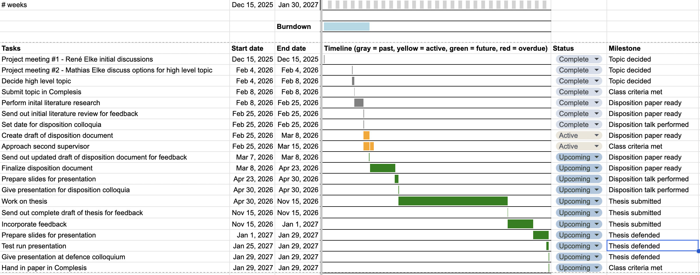

# Disposition

## Topic

The working title of the master's thesis is: *Biodiversity footprinting for the energy sector: A high-level assessment of the climate impact of the energy sector globally and in Switzerland using a life cycle assessment (LCA) approach*

The work will be carried out within the LCA research group and focus on LCA but will include a remote sensing part as well as an energy related part.

## Research aim and contribution

LCA in the energy sector often focuses primarily on impacts related to climate change. This thesis aims to extend this to the biodiversity impacts associated with energy production infrastructure on national and global scales. The main indicator will be land use, together with the biodiversity level that is evaluated based on spatial data defining the biodiversity level found in each spot.

The contribution is to provide estimates for the biodiversity loss caused by renewable energy production plants using a novel approach for this use case, and to compare against existing results.

## Research questions and hypotheses {#sec-research-questions}

- What is the biodiversity level in the areas in which RE plants can be found in? Hypothesis: PV plants are more likely found in areas with low biodiversity, e.g. deserts or mountain plateaus
- Which RE technology has the lowest biodiversity footprint? Hypothesis: Wind since it needs less space. Can we include threat to birds in the calculation somehow?
- Can these methods be used for detecting areas for putting RE plants to minimize biodiversity loss? (lots of papers)

<!--
### Methane

Methane leaks (oil and gas facilities, landfill sites): https://data.carbonmapper.org 

Carbon Mapper uses data from two satellites (Planet Labs Tanager-1 satellite and NASA EMIT instrument on the International Space Station) to measure the plumes as they pass overhead. Leak rates from a plume on different days are averaged and days with no leaks are taken into account. The satellites cannot collect data at night or through heavy clouds, so not every plume may be detected. The Stop Methane Project only considered plumes that were detected at least twice.

Upcoming EU legislation:
https://energy.ec.europa.eu/topics/carbon-management-and-fossil-fuels/methane-emissions_en

Guardian article:
https://www.theguardian.com/environment/2026/mar/17/revealed-world-worst-methane-leaks-global-heating

LCA:
https://esu-services.ch/fileadmin/download/jungbluth-2022-oilgas-FSLCI-20220914.pdf

### Tree crop

Monitoring tree crop expansion is vital for zero-deforestation policies like the European Union's Regulation on Deforestation-free Products (EUDR). However, these efforts are hindered by a lack of highresolution data distinguishing diverse agricultural systems from forests. Here, we present the first 10m-resolution tree crop map for South America, generated using a multi-modal, spatio-temporal deep learning model trained on Sentinel-1 and Sentinel-2 satellite imagery time series. The map identifies approximately 11 million hectares of tree crops, 23% of which is linked to 2000-2020 forest cover loss. Critically, our analysis reveals that existing regulatory maps supporting the EUDR often classify established agriculture, particularly smallholder agroforestry, as "forest". This discrepancy risks false deforestation alerts and unfair penalties for small-scale farmers. Our work mitigates this risk by providing a high-resolution baseline, supporting conservation policies that are effective, inclusive, and equitable. 
https://arxiv.org/abs/2602.17372

### Databases

The 2025 version of the Swiss Federal Administration BAFU database contains about 11000 LCIs for products and processes in 176 categories that include sectors such as construction, mobility, energy, metals, chemicals, paper, agriculture, food, consumption, and waste management. Data are regularly updated to reflect technological developments.
https://nexus.openlca.org/database/BAFU
-->

## Gap analysis

While land use from renewable energy infrastructure has been assessed using Threat-Abatement STAR (STAR$_T$) scores which quantifies how much species extinction risk could be reduced if biodiversity threats were removed, it has not been evaluated using LC-Impact.

Further gaps that might be worth looking at:

-   Biodiversity impact for factors other than land use, e.g. 
    -   Reviewing the potential for including habitat fragmentation to improve life cycle impact assessments for land use impacts on biodiversity https://link.springer.com/article/10.1007/s11367-019-01647-1

## Materials and methods

This section gives a brief overview of what can be expected in the thesis chapter on materials and methods.

### LCA integration

The main metric used will be LC-Impact (TBD describe). 

GLAM characterization factors from @scherer2023biodiversity include land use intensities and land fragmentation

<!--
If possible, the results gained from using will be LC-Impact cross checked against the results from @Gong2025 which is based on spatial Threat-Abatement STAR (STAR$_T$) scores introduced by @mair2021metric.
-->

### Spatial and remote sensing data

Describe existing data can be used for this project:

-   Biodiversity index per location: Ecoregions defined by @dinerstein2017ecoregion and available under a CC-BY-4.0 license online from @dinerstein2017ecoregion_resolve (as Shape file and in Earth Engine)
-   Renewable Energy infrastructure locations: @Gong2025 used the S&P Global Market Intelligence (S&P MI) database which provides detailed data on over 100.000 global power plants which is a commercial product that might potentially be available for research purposes. Open source alternatives exists, e.g. the ResourceWatch Global Power Plant Database https://resourcewatch.org/data/explore/Powerwatch or the Global energy monitor https://globalenergymonitor.org/ and several research papers such as @kruitwagen2021global who identified nearly 70.000 PV plants or @zeng2025global who provide yearly data about PV plant locations from 2019 to 2025.

<!--
-   Use foundation models, which are large-scale AI models pre-trained on large unlabeled Earth Observation data (satellite imagery, radar, weather) using self-supervised learning. They provide embeddings which are numerical representations of each pixel that can be employed for any task that relies on similarities between land cover.
-->

## Expected results

The following outcome is expected:

-   Thesis in scientific paper format with approximately 15 pages, will be submitted for publication

Non-goal: Developing a full data extraction framework or a scalable results interface is beyond the scope of this work (30 ECTS).

## Work plan and project schedule

The project schedule is pictured in @fig-timeplan. The live version of this plan can be found [here](https://docs.google.com/spreadsheets/d/1_QHeDnfFwLujNv_Hiss8qOS5SjA5-003iTmxzy1sRdA/edit?gid=1314943303#gid=1314943303).

{#fig-timeplan fig-align="center" width="100%"}

## Risk assessment

<!--
On a general level, there is a risk that the work will be taken out of context and used as an argument against renewable energy. This can be avoided by stating highly visible in the abstract of the work that renewable energy is critical for climate mitigation.
-->

No risks identified.

## Budget plan

No budgetary costs required.

## Literature study: current state of research {#sec-literature-study}

### Methodologies for biodiversity in LCA

@Winter2017 provide a comprehensive review of the state of biodiversity integration into Life Cycle Assessment (LCA). Their analysis of 119 biodiversity indicators reveals a gap in taxonomic coverage. While species and ecosystem diversity are relatively well-represented, genetic diversity is neglected. The study identifies a major disconnect between ecological theory and industrial practice, noting that models like ReCiPe focus on a narrow subset of pressures, and often use "species richness" synonymously with biodiversity. To bridge these gaps, the authors recommend systemic modifications across all four phases of the LCA process. Inventory data for missing pressures such as noise, artificial light, and odour should be developed. Impact assessment models that capture all three levels of biodiversity (ecosystem, species, genetics) through improved regionalisation and higher spatial resolution should be adopted.

@Deuber2026 proposes an enhanced hybrid framework to assess the biodiversity footprint of Swiss national consumption by integrating LC-IMPACT endpoint modeling with recent GLAM midpoint indicators. While prior assessments focused narrowly on land use, this approach expands coverage to stressors like global warming and terrestrial acidification. It allows for gradual updates in the methodology once improved GLAM midpoint indicators (e.g. for alien species introductions, marine acidification, or functional diversity) become available. For inventory modelling, the EE IO TRAIL (Environmentally Extended Input-Output Analysis using Trade Information and LCA) method is used in the Swiss context and the EE MRIO (Multi-Regional Input-Output) models are suggested for tracing global supply chains. The author advocates for sub-national regionalization of inventories to better identify and protect biodiversity hotspots.

### Biodiversity and satellite data

@Goetz2025 evaluate how different agricultural production systems affect biodiversity under intensified land use for permanent crops such as coffee, cocoa, and oil palm. The study integrates regionalized environmental and biodiversity impact characterization factors with crop-specific land-use and productivity data to provide a spatially explicit assessment of ecological impacts across production systems. The spatial data defining the ecological regions originates from @dinerstein2017ecoregion. The spatial agricultural production data originates from the Spatial Production Allocation Model defined in @you2014generating. The GLAM characterization factors in use are defined by @scherer2023biodiversity and include land use intensities and land fragmentation.

@posth2024bio introduce the Bio-Value-at-Risk (BioVaR) framework, which uses geospatial analysis to provide a bottom-up quantification of biodiversity risks by overlaying remote sensing data with spatial footprints of corporate assets. The underlying IBLG model structures the spatial association between operational activities and environmental impacts across four scales: Internal (within the property boundary), Bordering (immediate neighbourhood), Landscape (up to 1,000 km), and Global. High-resolution data from Landsat and Copernicus is used to calculate site-specific biodiversity loss footprints based on indicators such as Mean Species Abundance (MSA) as defined in the GLOBIO model by @schipper2020projecting or Potentially Disappeared Fraction (PDF) as used in LCA. Mapping the findings into a financial dimension via calibrated cost functions allows to translate physical ecological damage into site-specific financial costs. It can then be consistently aggregated for many purposes, such as corporate risk management and investment portfolio analysis.

@Hauser2025 define seven guiding principles for leveraging satellite remote sensing in corporate disclosure. Companies should clearly define the area, time period, and activities being assessed, including indirect effects beyond their own sites. They should cover key aspects of ecosystems using a small set of well defined LCA impact categories. Changes over time should be tracked to separate natural variation from human impacts. Environmental changes should be linked to company operations. Companies should assess how business performance depends on ecosystems, including related risks, and measure direct, indirect, and cumulative impacts across operations and supply chains. Finally, companies should consider the cross dependencies between impact categories.

#### Case studies

@Ma2023 evaluate coastal ecological risk by integrating deep learning-based oil spill monitoring with environmental vulnerability assessments. Utilizing Sentinel-1 images and the DeepLabv3+ network, the researchers achieve high accuracy in detecting oil spills by incorporating polarimetric synthetic aperture radar (PolSAR) and wind speed data. This is combined with a multidimensional vulnerability index covering water eutrophication, species diversity (zoobenthos and fish), and marine functional zoning using an Analytic Hierarchy Process weighted model. A case study of Jiaozhou Bay, China, reveals that the area faces ecological risk, with the highest threats concentrated in ports, shipping channels, and marine reserves. Many spills occur at night, likely due to illegal ship tank cleaning.

@dorber2018modeling uses satellite data to estimate the environmental impact from land use and land use change for hydropower reservoirs for application in an LCA. The study calculated an average net land occupation for water storage reservoirs in Norway, with an adjustment to account for the natural lakes that were often part of the reservoirs' area before impoundment, for a more comprehensive evaluation of the overall environmental footprint of hydroelectric power.

### Analysis of the effects of energy production on biodiversity

@Gong2025 measure the land-use induced biodiversity impacts for over 40,000 renewable energy plants by integrating spatial Threat-Abatement STAR (STAR$_T$) scores introduced by @mair2021metric with high-resolution satellite imagery to verify exact project footprints. The study found that solar power generates the largest aggregate biodiversity impact because of its extensive land requirements. Hydropower plants are disproportionately sited in the world's most biodiversity-sensitive locations. Total biodiversity loss from these installations has risen sharply over the last two decades, primarily driven by increased land use per project. It is highly concentrated, with just 1% of plants responsible for nearly 70% of the overall impact. Corporate finance applications reveal that ownership and financing structures significantly influence siting decisions. The researchers estimate that the ongoing expansion of renewable capacity could increase these impacts to a scale equivalent to Canada’s total land biodiversity value by 2030 and point out the need for targeted siting policies and stricter environmental safeguards.

@MCMANAMAY2021109234 evaluate the global biodiversity implications of alternative electrification strategies by developing a spatially explicit framework that combines high-resolution energy density estimates for ten renewable and conventional technologies with species richness data for birds, amphibians, mammals, and fish. The biodiversity footprint is measured as species impacted per GWh of energy produced. Biomass-powered electricity is identified as the most damaging to biodiversity, because its low energy density requires massive land assets that can overlap with biodiversity hotspots. Solar technologies are found to be land-sparing, because their high energy density allows global electricity demand to be met within a much smaller total footprint despite causing localized land degradation. The researchers find what they call a "protected area paradox", where strictly avoiding development on protected lands actually increases total biodiversity loss. Excluding energy-dense areas forces infrastructure into less optimal lower-density regions, consequently requiring a significantly larger geographical area to meet the same global energy needs. The authors recommend consolidating large-scale solar and wind development instead of patchy deployment, as it could significantly lessen the burden on global biodiversity.

@FONTANIER2025145735 evaluate the application of three biodiversity footprinting methods (Global Biodiversity Score, Product Biodiversity Footprint, and Site Biodiversity Footprint) to the French nuclear fleet, identifying water use for cooling and upstream value chain activities, such as uranium mining, as the primary drivers of biodiversity impact. The study demonstrates that while these tools are valuable for identifying hotspots, they require significant resources for data collection and specialized internal expertise. The authors advocate for greater standardisation and transparency in biodiversity modeling to enhance the reliability and comparability of footprint results across industrial sectors.

#### Case studies

@wang2025environmental study PV installations in an alpine meadow on the eastern Tibetan Plateau and find that air temperature rises in daytime and summer, but drops at night and in winter. Soil under panels is colder and drier, while gaps between panels are colder and wetter, extending the frozen period by roughly 50 days and slowing moisture loss up to 3.5×. These shifts alter local energy and water balances, warranting further studies to evaluate the long-term impacts on vegetation dynamics and permafrost processes.

# References
